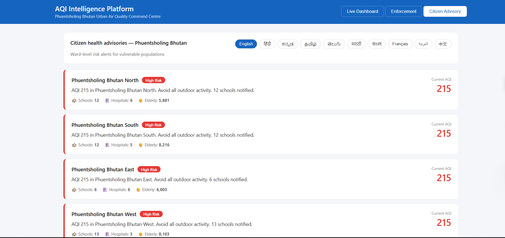
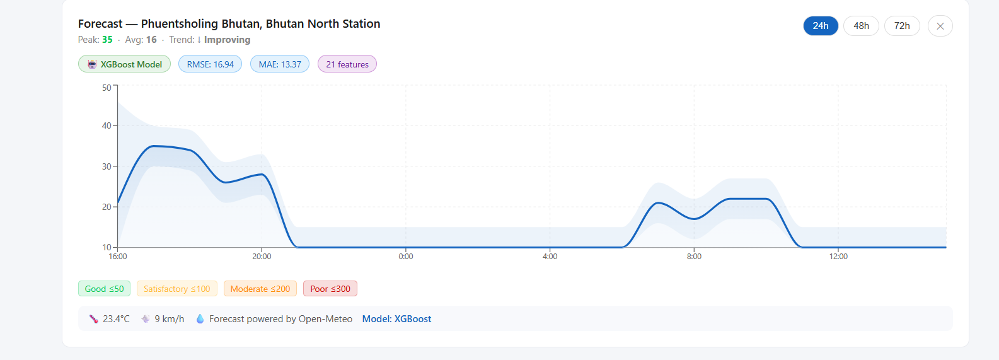
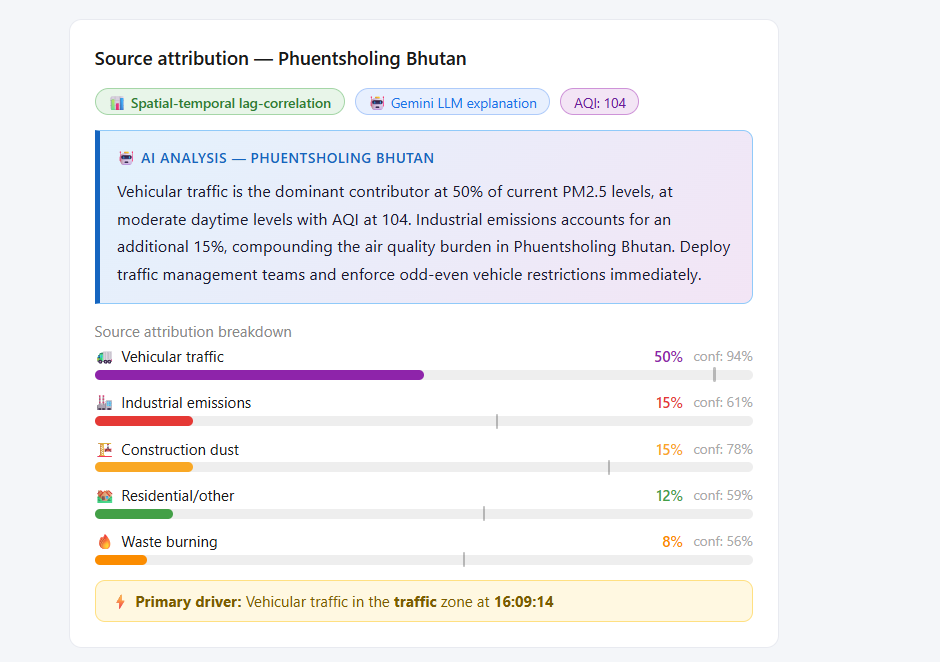
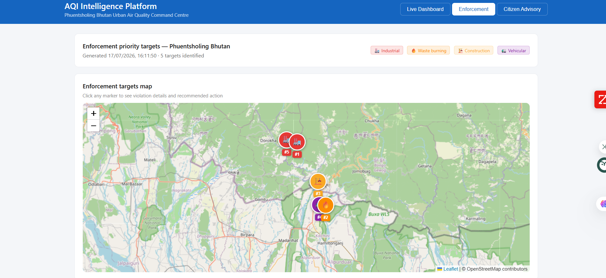
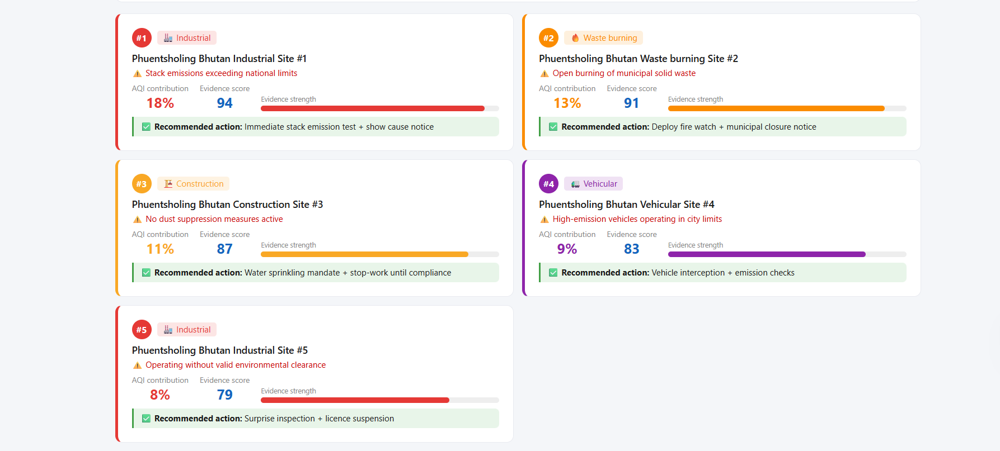

# AI-Powered Urban Air Quality Intelligence

### ET AI Hackathon 2026 — Problem Statement 5

A full-stack, multi-agent air quality intelligence platform that predicts hyperlocal AQI, traces pollution back to its source, prioritises enforcement action, and delivers multilingual health advisories to citizens — all in one dashboard.

Built with **FastAPI + XGBoost** on the backend and **React** on the frontend, the system is designed to help city authorities and citizens move from "what's the AQI today" to "where is the pollution coming from, what will it look like in 72 hours, and what should we do about it."

---

## Table of Contents
- [Overview](#overview)
- [Features](#features)
- [Screenshots](#screenshots)
- [Demo Video](#demo-video)
- [Tech Stack](#tech-stack)
- [Architecture](#architecture)
- [Quick Start](#quick-start-powershell)
- [API Endpoints](#api-endpoints)
- [Deployment](#deployment)

---

## Overview

Urban air pollution is hyperlocal, dynamic, and driven by many overlapping sources (traffic, construction, industry, stubble burning, etc.), making it hard for city authorities to act quickly and for citizens to know what protective steps to take. This project addresses that gap with **five coordinated AI agents** working behind a single FastAPI backend and React frontend:

1. **Source Attribution** — geospatially traces pollution back to likely sources (traffic corridors, construction zones, industrial clusters) for a given ward/area.
2. **AQI Forecasting** — an XGBoost-based model that predicts hyperlocal AQI 24–72 hours ahead per monitoring station.
3. **Enforcement Intelligence** — ranks and prioritises enforcement targets (which areas/sources need action first) based on predicted impact.
4. **Citizen Advisory** — generates multilingual (English, Hindi, Kannada) health risk advisories based on current and forecasted AQI.
5. **Multi-City Dashboard** — a comparative view across cities for at-a-glance benchmarking.

## Features

- 🔴 **Live AQI monitoring** across all stations in a city
- 📈 **72-hour AQI forecasting** powered by XGBoost
- 🗺️ **Source attribution** by ward/locality
- 🚨 **Enforcement ranking** to prioritise high-impact interventions
- 🗣️ **Multilingual citizen advisories** (en / hi / kn)
- 🏙️ **Multi-city comparison dashboard**
- ⚡ FastAPI backend with auto-generated interactive docs
- ⚛️ React + Vite frontend for a fast, responsive UI

## Screenshots

| | |
|---|---|
| **Home Page**  | **Citizen Advisory**  |
| **AQI Forecast (XGBoost)**  | **Source Attribution**  |
| **Enforcement Overview**  | **Enforcement Ranking**  |
| **Alert Banner**  | |

## Demo Video

[Add demo video link here]

## Tech Stack

**Backend**
- Python, FastAPI
- XGBoost (AQI forecasting model)
- PostGIS / Supabase (geospatial data)

**Frontend**
- React + Vite
- Modern component-based dashboard UI

**Infrastructure**
- Render (backend hosting)
- Vercel (frontend hosting)
- Supabase (managed PostGIS database)

## Architecture

```
5 AI Agents → FastAPI Backend → React Frontend
```

- **Agent 1** — Geospatial pollution source attribution
- **Agent 2** — Hyperlocal 24–72h AQI forecasting
- **Agent 3** — Enforcement intelligence & prioritisation
- **Agent 4** — Citizen health risk advisory (multilingual)
- **Agent 5** — Multi-city comparative dashboard

## Quick Start (PowerShell)

### Backend
```powershell
cd backend
python -m venv venv
.\venv\Scripts\Activate.ps1
pip install -r requirements.txt
copy .env.example .env
uvicorn app.main:app --reload --port 8000
```
- API runs at http://localhost:8000
- Interactive docs at http://localhost:8000/docs

### Frontend
```powershell
cd frontend
npm install
copy .env.example .env.local
npm run dev
```
- App runs at http://localhost:5173

## API Endpoints

| Method | Endpoint | Description |
|---|---|---|
| GET | `/aqi/live` | All station readings |
| GET | `/aqi/forecast/{station_id}` | 72h forecast for a station |
| GET | `/attribution/?ward=Silk+Board` | Source attribution for a ward |
| GET | `/enforcement/?city=Bengaluru` | Enforcement targets for a city |
| GET | `/advisory/?language=en` | Citizen advisories (en/hi/kn) |

## Deployment

- **Backend** → [Render](https://render.com) — connect GitHub, set root dir to `backend`
- **Frontend** → [Vercel](https://vercel.com) — connect GitHub, set root dir to `frontend`
- **Database** → [Supabase](https://supabase.com) — free PostGIS
